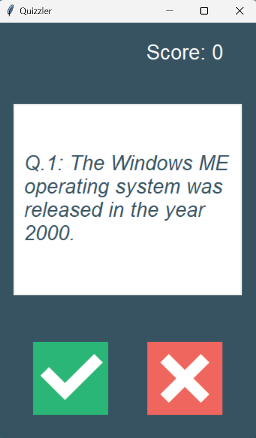
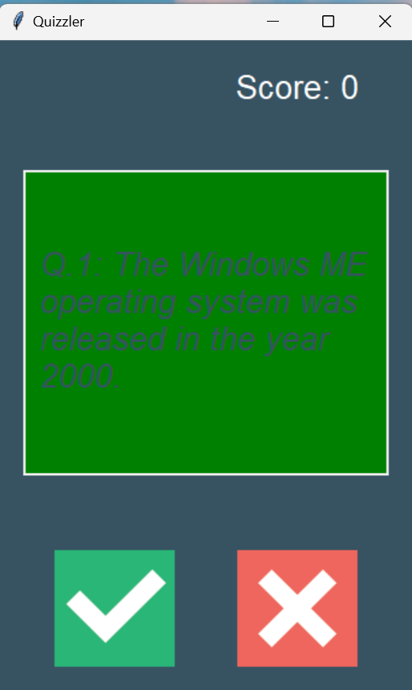
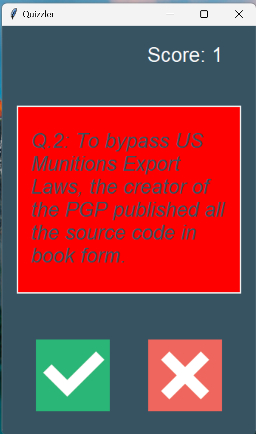

# Quizzler is a GUI based quiz app using API, tkinter and OOP in pyhton
# This project is created using python 3.12 and pycharm IDE

**Steps to run the project**
1. Install python 3.12
2. Install module requests
3. Run main.py in the IDE

# Usage Guide
- Upon running the main.py ,API fetches 15 computer science questions.

- User have to answer "Ture" or "False" by clicking ✅ or ❌ button.

- If the user's answer is correct then the canvas screen turns green for 1 second.

- If user's answer is wrong then the canvas screen turns red for 1 second.

- In the end final score is displayed.

- User can directly run the quizzler.exe file on windows to run the app

### Created by AQIB ALI

